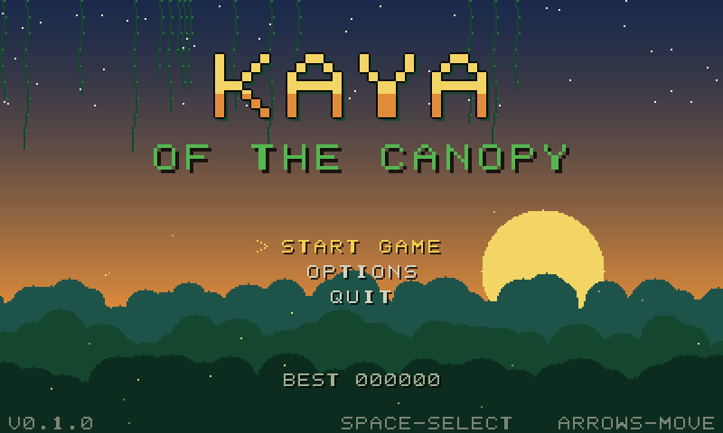
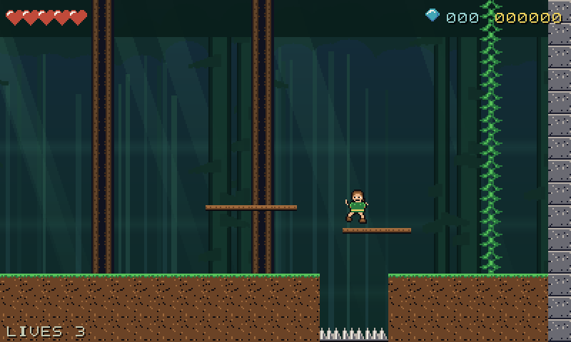
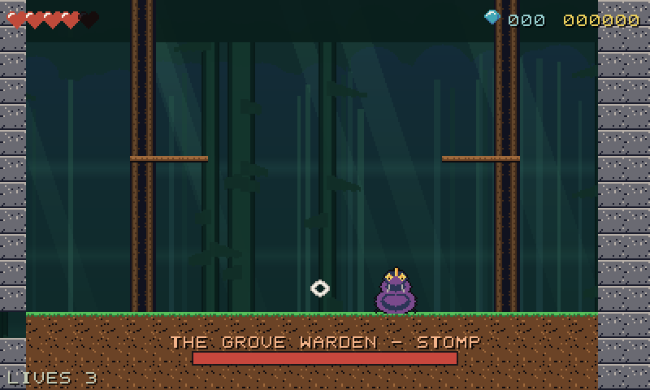
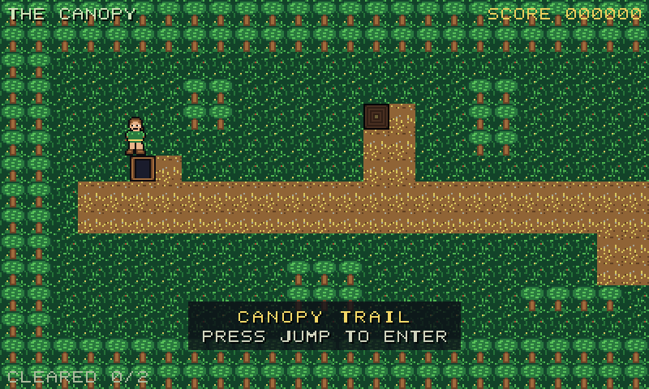
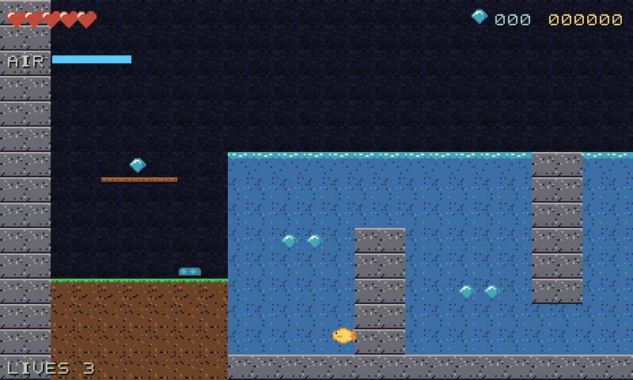

# Kaya of the Canopy

An original 2D jungle platformer in the spirit of early-90s DOS action games:
16×16 tiles, screen-flip scrolling, an overworld hub, animal transformations and
a boomerang blade. Built in **Godot 4.7** at a logical **400×240**, integer-scaled.



**Every asset is original and generated by scripts in `tools/`** — the tileset,
all four player forms, the enemies and boss, the 8×8 bitmap font, the parallax
backdrops, the store icons, and all 29 sound effects and 6 chiptune tracks.
No third-party art, audio or level data.

| | |
|---|---|
|  |  |
| Jumping a spike pit in CANOPY TRAIL | The three-phase Grove Warden |
|  |  |
| The overworld hub, gateways gated on save flags | The fish form crossing THE WATERWAY |

## Playing it

```bash
cp tools/env.sh.example tools/env.sh   # then point it at your Godot + Python venv
tools/export_web.sh
python3 -m http.server -d build/web 8080
```

Or open the project in Godot 4.7 and press F5.

**Controls:** arrows/WASD move, Space jumps, Enter/J throws the blade, Esc pauses.
Gamepads are picked up automatically; on a touchscreen a floating d-pad and two
buttons appear instead.

## What's in it

- **Five levels plus a hub.** CANOPY TRAIL, ROOT HOLLOW (keys, doors, switch
  blocks), THE WATERWAY (fish form), SKY BRANCH (frog and bird), and HEART OF
  THE GROVE (boss). Gateways unlock as you clear them; the last one needs all.
- **Four forms.** Kaya on foot with the returning blade; the frog (huge jump,
  wall cling, no weapon); the fish (eight-way swimming, an air timer, a bite);
  the bird (flap on a stamina budget, glide, perch to refill).
- **Six enemy types** — walker, jumper, shooter, swimmer, plus a three-phase
  boss — all tuned from `data/enemies/*.json` without touching code.

## How it's built

```
src/core/     state machine, save, audio, main scene
src/world/    tile collision, level loading, camera, triggers
src/player/   forms and weapons
src/enemies/  enemy AI and projectiles
src/hub/      overworld
src/ui/       HUD, menus, touch controls, pixel font
data/         all tunables (tiles, forms, enemies, weapons)
levels/       JSON char-grid levels
tools/        art/audio/level generators, capture harness, export scripts
tests/        headless unit tests + in-game integration suite
```

Three decisions worth reading about, written up in `docs/adr/`:

1. **[Custom AABB tile collision on a fixed 60 Hz step](docs/adr/001-custom-collision-and-fixed-timestep.md)** —
   no engine physics bodies for gameplay, so the whole collision model is
   testable headless.
2. **[Levels are JSON char-grids, not LDtk](docs/adr/002-level-format.md)** —
   diffable, validated by tests, and authored from a small Python DSL.
3. **[Two test tiers](docs/adr/003-two-test-tiers.md)** — `--headless --script`
   has no autoloads and no scene tree, so node behaviour needs a second tier
   that boots the real game.

## Verifying it

```bash
tools/test.sh          # 57 headless unit tests, 529 assertions
tools/itest.sh         # 172 in-game integration checks (needs a display)
tools/validate.sh      # scripts compile, scenes resolve, levels and data parse
tools/smoke_build.sh   # boots an *exported* build, fails on startup errors
```

The integration tier isn't decoration — it caught a type error that silently
killed every second blade throw, a boomerang that tripped switches twice and
cancelled itself out, and a `PROCESS_MODE_ALWAYS` on the root node that made
pause a no-op for the entire world. The build smoke test caught a release-only
crash from an autoload the export filter was stripping.

## Shipping

Web and macOS builds are produced and verified. Android and iOS presets and
scripts exist but are blocked on local prerequisites (JDK + Android SDK; an
Apple team id). See **[docs/shipping.md](docs/shipping.md)**.

## Status

Playable start to finish in the sense that every level has a spawn, an exit,
matching keys for its doors and a working boss gate — all asserted by tests.
**Levels 2–5 have not yet been played through by a human**, so the platforming
difficulty is unproven. That's the top playtest priority; jump and throw feel
are meant to be tuned on a device and fed back into `data/forms/*.json`.

---

Inspired by the feel of early-90s DOS platformers. Not affiliated with any
existing game; all characters, art, music and level layouts are original.
