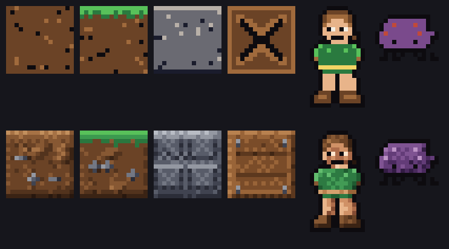

# Art overhaul plan — towards the Apogee VGA look

Reference points: *Bio Menace*, *Duke Nukem II*, *Halloween Harry*. This is a
plan to close the gap, ordered so each phase ships a visible improvement on its
own and can be stopped after.

## Diagnosis — measured, not guessed

```
tileset distinct colours:      18
kaya sprite distinct colours:   9
shades per hue family:      max 4, typically 2
```

Apogee's VGA games ran a 256-colour palette with **6–10 shades of every
material**. That single number is the root cause: with two or three shades you
can fill a region, but you cannot model a surface. Everything reads flat because
it *is* flat.

Three deficits, in order of how much they cost us:

1. **No shade ramps.** No highlights, no occlusion, no dithered transitions.
2. **No tile variety.** One `dirt` tile repeated forever, no edges, no corners,
   no decorative overlays. Terrain reads as a rectangle of wallpaper.
3. **Thin animation and no atmosphere.** Three-frame run cycle, no particles,
   no animated tiles, uniform lighting across every screen.

## Proof of concept

`tools/proto_shade.py` (not wired into the game) demonstrated phases 1 and 2 on
four tiles and two sprites. Result: `docs/art-proto.png` — top row current,
bottom row prototype. **Phase 1 promoted it into `tools/art/palette.py`**; the
script is kept only as the record of the experiment.



Two findings worth carrying into the plan:

- **Sprites transform with shading alone.** Distance-to-edge plus a light
  direction gives Kaya and the beetle real volume for no authoring effort.
- **Tiles do not.** Replacing noise with a gradient made them *softer*, not
  better. Apogee tiles contain discrete *things* — pebbles, mortar courses,
  planks, nails — each with its own highlight and shadow. Structure first, then
  shading. That is what the second prototype pass does.

---

## Phase 1 — Palette and shading engine — **DONE**
**The foundation. Biggest single win, and nothing downstream works without it.**

Shipped on `art/phase1-palette`. What was actually built, and where the plan
below was wrong, is in "Phase 1 as built" at the end of this document.

- Replace the 18 flat colours with ~8 material ramps × 7 steps (~50 colours,
  VGA-appropriate).
- Add to `tools/gen_art.py`: `dither()` (4×4 Bayer, for transitions the palette
  cannot express), `blob()` (a lump with a lit and shadowed face), `crack()`,
  and `auto_shade()` (re-lights existing ASCII art from a light direction).
- Re-render every tile and sprite through it.

**Touches:** `tools/gen_art.py` only. Tile ids, the level legend, collision and
every test are untouched — this is a pure repaint.
**Risk:** none to gameplay. **Effort:** the prototype is most of it.

## Phase 2 — Tile variety and autotiling
**The biggest structural change, and the biggest jump after phase 1.**

- **Autotiling.** Generate the 47-tile blob set per terrain material, and pick
  the variant at load time from the eight neighbours. Terrain stops being
  rectangles and grows proper edges, corners and inside curves.
- **Random variants.** 3–4 interchangeable versions of each fill tile, chosen by
  a position hash so a wall never tiles visibly.
- **Decorative overlays** on the background layer: roots, hanging vines, cracks,
  moss, bones, pipework.

**Touches:** `gen_art.py`, `tile_renderer.gd` (variant lookup),
`level_loader.gd` (neighbour resolution at load). The authored level format does
**not** change — variants are derived, so `levels/*.json` and
`tools/build_levels.py` stay as they are.
**Risk:** moderate. Needs a new test that every material has a complete variant
set, or holes appear only in level geometry nobody walks past.

## Phase 3 — Depth and light — **DONE**

Shipped on `art/phase3-depth`. Lighting is additive pools, decided on measured
numbers; what was built and where the plan below was wrong is in "Phase 3 as
built" at the end of this document.

- Per-world background tilesets drawn with **desaturated, darker ramp steps** —
  atmospheric perspective, the trick that gives Duke II its depth.
- Replace the procedural parallax silhouettes with real layered art.
- **Lighting.** Either additive light-pool sprites (cheap, predictable) or
  `Light2D` with a `CanvasModulate` ambient (better, costs fill rate).
  **Decide on device** — this is the one phase with a real mobile perf risk.
- Per-level ambient tint, so ROOT HOLLOW feels underground and SKY BRANCH airy.

**Risk:** the only phase that can cost frame rate. Prototype it on the iPhone
before committing.

## Phase 4 — Sprites and animation
- Kaya: 6–8 frame run with weight, jump anticipation, landing squash, a proper
  hurt pose.
- Enemies: 4+ frames each; the walker currently has two.
- Boss: larger (48×48) with visually distinct phases rather than a colour swap.

**Touches:** `gen_art.py` and `data/forms/*.json` (frame lists only — the anim
system already reads them, so no code change).
**Optional, flagged as a decision:** enlarging Kaya from 16×24 to ~20×28 would
buy detail room, but changes the hitbox and therefore every level's clearances.
The headroom tests would catch the fallout, but it is real churn. Recommend
**not** doing this unless the sprite detail proves cramped.

## Phase 5 — Motion and juice
Cheap, and disproportionately effective:
- Animated tiles: water surface, lava, swaying foliage, flickering light.
- Particles: landing dust, blade sparks, gem shimmer, leaf scatter on a hit.
- Screen shake on the boss slam; brief hitstop on a kill.

**Effort:** small. **Impact on perceived quality:** large.

## Phase 6 — Consistency and performance pass
Sweep for mismatched materials, verify texture memory and draw calls on device,
re-capture `shots/` and regenerate the store screenshots
(`tools/genstoreshots.sh` picks up new art automatically).

---

## Sequencing

Phase 1 alone is worth doing and lands quickly. Phase 2 is where it starts
looking like an Apogee game. Phase 5 is cheap enough to slot in any time and
flatters everything before it.

Phases 1, 2, 4 and 5 carry no gameplay risk — they are art pipeline and data.
Phase 3 is the one to prototype on hardware first.

## What stays true throughout

Everything remains **generated by scripts in `tools/`** and therefore original.
No phase introduces third-party assets. The generators get richer; the rule does
not change.

---

## Phase 1 as built

Delivered as planned: ramps, `dither()`, `blob()`, `crack()`, `auto_shade()`,
every tile and sprite re-rendered, tile ids and levels byte-identical. Plus the
module split the later phases need: `tools/art/{palette,tiles,sprites,
backdrops}.py`, with `tools/gen_art.py` reduced to the running order.

Measured, the same way the diagnosis was:

```
tileset distinct colours:      18  ->  67
kaya sprite distinct colours:   9  ->  26
generated palette:            12 ramps x 7 steps + ink = 85 colours
```

Six places the plan above was wrong or incomplete. They are worth carrying
forward, because four of them change what phase 2 has to do.

**1. Eight ramps is not enough — it took twelve.** The prototype covered dirt,
grass, stone, wood, skin, tunic and purple. The rest of the game needs water
(three tiles plus the piranha and the gem), metal (spikes, plates, the blade,
every eye highlight), gold (switch blocks, keys, the belt, the logo) and ember
(lava, hearts, the hurt pose). At seven steps that is 85 colours, not the ~50
the plan estimated. Still well inside a VGA budget, but the estimate was low
because it was taken from the prototype's sample rather than from the asset
list.

**2. The prototype's `auto_shade()` double-counts the outline, and it shows on
anything thin.** It treats the ink outline as background, so on a limb three
pixels wide every pixel is adjacent to "outside" and gets the full rim
highlight — the sprite comes out uniformly two steps too pale with no internal
relief. The fix is to keep two notions of inside: *volume* measured against the
whole silhouette including the outline, and *facing* measured against the
material only. That is what is in `palette.auto_shade()` now. It is not visible
on the prototype's two sprites; it is obvious across all of Kaya's eight frames.

**3. "Tiles do not transform with shading alone" is right, and there is a
corollary the plan misses.** Authored structure makes a tile read as material —
but a *fill* tile has exactly one variant, so any structure strong enough to
read also repeats visibly across a whole screen. Background leaves and hub grass
both had to be deliberately held back, and a single flower authored into the hub
grass tile turned the overworld into a perfect grid of flowers and was removed.
**So the phase 2 variant sets are a prerequisite for finishing phase 1's fill
tiles, not just an improvement on top of them.** The terrain tiles that carry a
strong read — masonry, bark, crate, lava, metal — are the ones with genuine
structure; the fills are holding.

**4. Backdrops could not wait for phase 3.** The plan scopes phase 1 to tiles
and sprites and gives the parallax and title art to phase 3. But leaving them on
the old flat colours puts two colour vocabularies on screen at once, which looks
worse than either. They were moved onto the ramps — same silhouettes, same
generators, ramp steps instead of literals. Phase 3's job (real layered art,
per-world tilesets, lighting) is untouched.

**5. A cross-ramp gradient has to be routed by hand.** The title sky runs night
blue to sunset orange, which no single material ramp does. Dithering directly
between `water` and `gold` bands hard, because the two are far apart in hue at
similar luminance. It needs an ordered path *through* the ramps — water, purple
as the bridge, then ember and gold — chosen so every neighbouring pair is close
enough that a Bayer mix reads as a gradient. That list is `backdrops.DUSK`.

**6. "The prototype is most of it" was optimistic.** The prototype covered four
tiles and two sprites; the game has 28 tiles and about fifty sprite cells, and
the per-material tuning is most of the work. It was closer to a third. The
engine really was most of the *hard* part, which is probably what was meant.

**One thing the plan under-sold.** Because every colour now comes from a
generated manifest (`assets/palette.json`), the ramp discipline is *testable* —
`tests/test_art_palette.gd` asserts that no sheet contains a colour that is not
a step on a ramp. Nothing else would catch one hand-picked literal slipping into
a generator, and that check is what stops the palette eroding across phases 2-6
as four more people's worth of art gets added to it.

---

## Phase 3 as built

Delivered: three parallax planes per world instead of two flat strips, painted
through an explicit depth model; a per-level ambience file; and lighting, which
after measurement is **additive light pools, not `Light2D`**.

Measured, the same way everything else here is:

```
parallax planes per level:        2  ->  3   (sky / far / near)
backdrop worlds:                  1  ->  2   (jungle, sky)
colours off the ramps, backdrops: 0  ->  0   (they are ramp output now, and tested)
draw calls, a lit level:         13  ->  17
frame cost of all of phase 3:          +0.05 .. +0.19 ms   (see below)
```

### The lighting decision, with the numbers

The plan says to decide on device. The device is not in this loop, so it was
decided on the two things that *are* measurable here and do carry to a phone:
the ratio between the two implementations on the same renderer, and what each
one does to readability.

`tools/dev_capture.gd` grew a `{"perf": …}` step: it drops vsync, lifts the fps
cap and reports wall-clock frame time, the renderer's own CPU time, draw calls
and video memory. `tools/seq/perf.json` measures every level **twice in the same
process**, lighting on and off, because measuring two separate launches of the
game mostly measures how warm the machine was. GPU timestamps read 0.000 — the
GL Compatibility backend does not report them on macOS — so wall-clock frame
time is the gate, and the fill-rate argument is made by arithmetic below.

All of phase 3, lit vs unlit, same process, 240 frames each:

```
                lit      unlit     delta     draw calls
jungle_1       0.728 ms  0.666 ms  +0.06 ms   17 / 14
jungle_2       0.920     0.726     +0.19      18 / 15
jungle_3       0.844     0.780     +0.06      20 / 17
jungle_4       0.709     0.636     +0.07      17 / 14
jungle_5       0.805     0.756     +0.05      19 / 16
```

One representative run; repeating it moves the third decimal but not the band.
Against the 16.6 ms frame that is 0.3–1.1% of the budget, for three extra draw
calls: one haze quad, one vignette, one batch of pools.

Then the same scene with `Light2D` + `CanvasModulate` instead — same pool
texture, same positions, same count, built as a throwaway branch purely to get
the number:

```
ROOT HOLLOW, 7 lights      pools 0.852 / 0.872 ms     Light2D 1.327 ms   +55%
HEART OF THE GROVE, 4      pools 0.679               Light2D 0.708      + 4%
```

The cost scales with the number of lights overlapping the screen, which is what
you would expect: in the compatibility renderer each light is another pass over
every canvas item it touches, and a tile layer is one canvas item holding a few
hundred draw commands. Seven lights over ROOT HOLLOW's tile layers is seven
extra traversals of those commands. Fewer draw calls, more work — the draw-call
monitor actually reads *lower* for the `Light2D` version (16 vs 18), which is a
good reminder that draw calls are a proxy and frame time is not.

So the cheap variant wins on cost. It also wins on the thing that was supposed
to be `Light2D`'s advantage, which is the part worth writing down:

**`CanvasModulate` dims the player.** It applies to everything in its canvas
layer, so Kaya, the enemies, the gems and the hearts all go down with the room.
`shots/56_phase3_light2d_rejected.png` is the capture the decision was made on:
the rejected `Light2D` build on the left, the shipped pools on the right, same
level, same lights. The brief's hard constraint is
that a player must instantly be able to tell what is solid; a lighting model
whose ambient term lands on the player works against that at exactly the moment
the level is darkest. The pools are ordered into the scene *behind the
entities*, so a dark level now has **more** contrast between Kaya and the floor
than a bright one, not less. That ordering is the reason the layers are three
nodes and not one, and it is checked in the integration suite, because it is
invisible until it is wrong.

On fill rate, since that was the stated risk: a lit screen blends roughly
800,000 pixels per frame — three parallax planes, two tile layers, a haze quad,
a vignette and a handful of pools over 400x240. At 60 Hz that is under 50
Mpix/s. Any phone that can run the game at all clears that by more than an order
of magnitude; the pools are capped at 16 per frame so a screen of water surface
cannot turn into a hundred quads. **Still to do on device:** confirm on the
iPhone that the added texture memory (+1.0 MB, 27.3 total) and the extra
per-frame alpha blending behave, and re-check with the touch overlay drawn.

### The depth model

The old strips were painted at the dark end of `foliage` — every one of them. So
the furthest thing on screen was also the highest-contrast thing on screen: a
black wall behind a lit jungle. The plan's own sentence ("distance reads as
lower contrast, not just smaller") was the fix, and it is now structural rather
than a matter of care.

`tools/art/backdrops.Plane` owns a slice of one ramp — its *window* — and every
brush paints in **material value**, 0 for the shadowed side of a thing and 1 for
the lit side. The plane maps that onto its window when it renders. The width of
the window is therefore the plane's entire contrast budget, and a far plane with
1.2 steps cannot out-contrast a near plane with 2.2 however it is drawn. The
numbers are printed by `tools/genart.sh` and the planes' own docstrings say
which is which.

Two things fall out of that and neither was obvious before building it:

- **Distance can be brighter.** Haze lightens what is behind it. The jungle sky
  plane is a pale blue-grey, well above the tiles in front of it, and it reads
  as further away than the old near-black did — because what fell off is the
  contrast, not the brightness.
- **A material's window is not the plane's window.** SKY BRANCH's far plane
  holds both a cloud sea and the canopy far below it. One window for both put a
  dark saturated green slab directly behind the play field: the busiest edge on
  screen, in the worst place. Materials get per-ramp window overrides, used
  sparingly — the canopy is painted pale, which is also what a forest seen
  through that much air actually looks like.

### Six places the plan was wrong

**1. Two of the five levels cannot show a backdrop at all.** ROOT HOLLOW and THE
WATERWAY author a solid wall of `bg_rock` behind every tile of every screen —
measured, 0% of either level has the parallax visible, against 54–69% for the
other three. "Per-world background tilesets" would have meant drawing a cave set
and a water set that no one would ever see. So two worlds were built, `jungle`
and `sky`, and the two walled levels get their depth entirely from ambient tint,
vignette and light pools. That is also why the ambience file separates "which
backdrop" from "what the air is doing": for half the game only the second half
of that applies.

**2. "Desaturated, darker ramp steps" is half right and the wrong half is
load-bearing.** Desaturated, yes. Darker, no — see the depth model above. Had
the phase been built to the plan's wording it would have produced a slightly
nicer version of the problem it was meant to fix.

**3. A per-level ambient tint is three numbers, not a colour.** It started as one
RGB per layer and the grove came out magenta: a violet tint at full strength cuts
a quarter of the green out of every brown tile in the level. It needs the hue
(a ramp step), how much of that hue to take, and how far to knock the layer back,
as three separate fields. Only then can a level be pushed violet without being
pushed *purple*.

**4. The mood had to live outside `levels/*.json`.** The level files are shared
with `tools/build_levels.py`, the validators and every test that parses them,
and the brief froze them. `data/ambience.json` keys off the level id instead,
which turned out better than an inline field would have been: an artist can
re-light the whole game without touching a single tile, and the lighting can be
switched off wholesale for a measurement.

**5. The real cost of `Light2D` here is not fill rate.** The plan's parenthetical
is "better, costs fill rate". At 400x240 fill rate is not what hurts; the extra
pass over every canvas item per light is. Worth knowing, because it means the
cost scales with *lights overlapping the screen*, not with how big they are —
the opposite of the intuition the plan was working from.

**6. "Prototype it on the iPhone before committing" could not be honoured, and
the fallback is not as good.** What is in hand is a same-process A/B on one
desktop GL driver plus an arithmetic argument about overdraw. It is enough to
choose between two implementations that differ by 55%; it is not enough to
certify a frame budget on a tile-based mobile GPU. The device check is listed
above as outstanding, and phase 6 is where it belongs.

**One thing the plan under-sold.** Because the planes are ramp output now rather
than blends, the backdrop exemption in `tests/test_art_palette.gd` could be
closed: `tests/test_art_depth.gd` asserts every plane and both lighting textures
are pure ramp, that each plane is exactly one screen (which is what makes the
vertical lock seam-free), that the sky plane has no holes in it, that no plane
out-contrasts the tileset, and — the one that will actually catch someone — that
no level's ambience may dim the solid layer below two thirds or below its own
background layer. The readability constraint was the one thing in this phase a
data file could break silently, and now it cannot.
